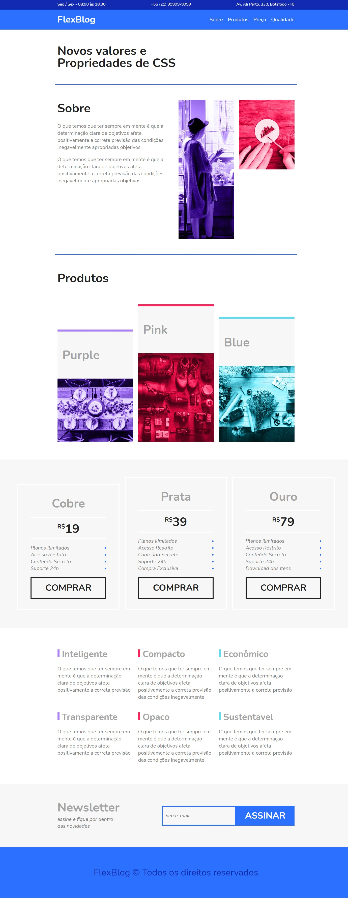
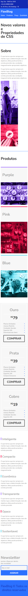

# 💻 FlexBlog

---

## 🗒️ Sobre o projeto

FlexBlog é uma pagina feita para praticar as propriedades do flexbox.

<a href="https://vleonecezar.github.io/flexblog/">CLIQUE AQUI PARA TESTAR</a>

---

## 🛠 Tecnologias

### Frontend:

-   HTML
-   CSS

---

## 🎨 Screens

### Web

  

### Mobile

  

